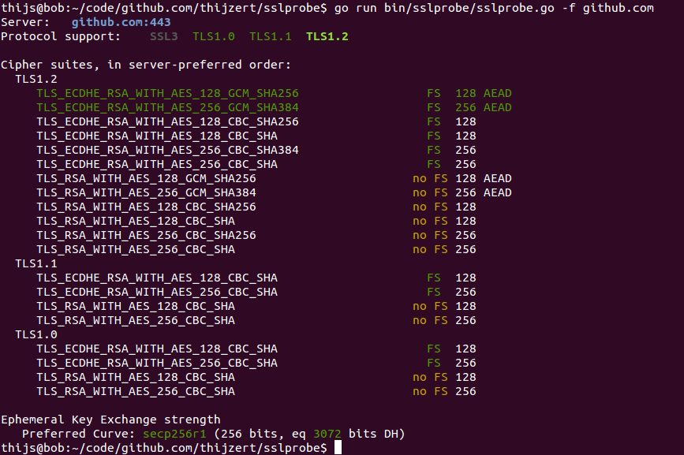

sslprobe
========

sslprobe is a tool that maps out a server's TLS configuration and identifies potential problems, such as supporting obsolete protocols or preferring weak cipher suites.
I like to play with Qualys' SSLLabs a lot, so I decided to make my own.

Usage
-----
From the command-line, type:
```
go run bin/sslprobe/sslprobe.go [{OPTIONS}] {HOST}
```
e.g.
```
go run bin/sslprobe/sslprobe.go github.com
```
Options include:

* *-f* or *--full*: perform cipher preference scans on all supported versions instead of just the highest;
* *-q* or *--quick*: don't perform cipher preference scans at all.

Example output:


License
-------

This repository is shared under a BSD 3-clause license. See the file COPYING for details.

This repository also contains files imported from the Go project. Luckily, these files are similarly licensed.
